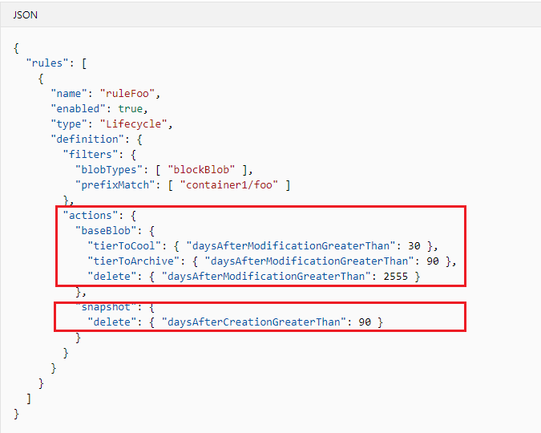

# Azure_Storage_Retention_Policy_Set_Via_REST_API

Note that you can now set Azure Storage Time-Based Retention Policies today via the Azure REST API. You can also “TRY” all these REST API’s interactively using the Microsoft documentation links below: 

   [Storage Management: Add or remove a policy](https://docs.microsoft.com/en-us/azure/storage/blobs/storage-lifecycle-management-concepts#add-or-remove-a-policy)

   [Management Policies - Create Or Update](https://docs.microsoft.com/en-us/rest/api/storagerp/managementpolicies/createorupdate)

Note the Azure Storage Retention settings that you can address in the JSON Policy file below:

   

The use of these types of storage retention policies can make for a completely automated and cost-effective storage retention strategy.
You can set the following storage retention attributes:
      * Tier-To-Cool
      * Tier-To-Archive
      * Delete
      * Snaphot Deletes

To make this Azure REST API call from within a C# Console application – you will first need to create an AD Service Principal with the appropriate permissions assigned:

 * [How to use the portal to create an Azure AD application and service principal that can access resources](https://docs.microsoft.com/en-us/azure/active-directory/develop/howto-create-service-principal-portal)
 
* Be sure to capture the Application ID and generated password for the secret you create.

Attached is a *Sample* C# .NET Core (2.2) console application that does the following:
*	Generates a security token based on your subscription and credentials.
*	Creates an Azure REST API request and sends the updated JSON policy file as part of an HTTP PUT operation.
*	If Successful, (HTTP Status == 200 OK) then the updated JSON policy is returned in the response.
*	To use: FIRST: Replace all <YOUR INFO> occurrences with your specific Azure Subscription details.
